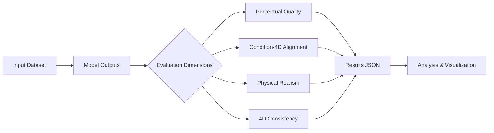

# 4DWorldBench

<div align="center">

**A Comprehensive Evaluation Framework for 3D/4D World Generation Models**

**CVPR 2026**


[🏠 Homepage](https://yeppp27.github.io/4DWorldBench.github.io/) | [📝 Paper](https://arxiv.org/pdf/2511.19836) | [🤗 Dataset](#) | [📊 Leaderboard](#)

</div>

---

## 📖 Overview

World Generation Models are emerging as a cornerstone of next-generation multimodal intelligence systems. Unlike traditional 2D visual generation, World Models aim to construct **realistic**, **dynamic**, and **physically consistent** 3D/4D worlds from images, videos, or text. These models not only need to produce high-fidelity visual content but also maintain coherence across space, time, physics, and instruction control, enabling applications in virtual reality, autonomous driving, embodied intelligence, and content creation.

However, prior benchmarks emphasize different evaluation dimensions and lack a unified assessment of world-realism capability. To systematically evaluate World Models, we introduce **4DWorldBench**, which measures models across four key dimensions:

- 🎨 **Perceptual Quality** - Visual fidelity and aesthetic appeal
- 🎯 **Condition-4D Alignment** - Alignment with input conditions (text/image/video)
- ⚛️ **Physical Realism** - Physical plausibility and consistency
- 🔄 **4D Consistency** - Temporal and spatial coherence

## ✨ Key Features

- **Comprehensive Evaluation**: Four key dimensions covering perceptual quality, condition-4D alignment, physical realism, and 4D consistency
- **Multi-Task Support**: Image-to-3D/4D, Video-to-4D, and Text-to-3D/4D generation tasks
- **Adaptive Hybrid Evaluation**: Integrates LLM-as-judge, MLLM-as-judge, and traditional network-based methods with adaptive tool selection that achieves closer agreement with human judgments
- **Unified Textual Space**: Maps all modality conditions into a unified textual space for consistent cross-modal evaluation
- **Easy-to-Use**: One-command evaluation with flexible configuration
- **Extensive Model Support**: Pre-configured for 18+ state-of-the-art world generation models

## 🎯 Evaluation Dimensions

### 1. 🎨 Perceptual Quality
Measures the visual quality and aesthetic appeal of generated 3D/4D worlds.

**Sub-dimensions:**
- **Spatial Quality**: Frame-level fidelity and technical quality (CLIP-IQA+, CLIP-Aesthetic)
- **Temporal Quality**: Temporal coherence and visual stability (FastVQA)
- **3D Texture Quality**: 3D texture realism (mPLUG-Owl3)

### 2. 🎯 Condition-4D Alignment
Evaluates how well the generated world aligns with input conditions.

**Sub-dimensions:**
- **Event Control**: Story plot and narrative progression
- **Scene Control**: Landscape and environment fidelity
- **Attribute & Relationship Control**: Object attributes and spatial relationships
- **Motion Control**: Temporal motion alignment and camera trajectory accuracy

### 3. ⚛️ Physical Realism
Assesses the physical plausibility and realism of generated worlds using LLM-based reasoning.

**Sub-dimensions:**
- **Dynamics**: Mechanics, gravity, buoyancy, pressure, etc.
- **Optics**: Refraction, reflection, Tyndall effect, etc.
- **Thermal**: Heating, phase transitions, etc.

### 4. 🔄 4D Consistency
Measures temporal and viewpoint consistency.

**Sub-dimensions:**
- **Viewpoint Consistency**: Multi-view geometric consistency (DROID-SLAM reprojection error)
- **Motion Consistency**: Temporal motion continuity (optical flow + MLLM-based QA)
- **Style Consistency**: Visual style coherence across frames (VGG Gram-matrix distance)

## 📦 Installation

### Prerequisites
- Python 3.8+
- CUDA 11.0+ (for GPU acceleration)

### Setup

```bash
# Clone the repository
git clone https://github.com/your-org/4DWorldBench.git
cd 4DWorldBench

# Create conda environment
conda create -n 4dworldbench python=3.8
conda activate 4dworldbench

# Install dependencies
pip install torch==2.5.1 torchvision==0.20.1 torchaudio==2.5.1 --index-url https://download.pytorch.org/whl/cu118

pip install -r requirements.txt
wget https://github.com/Dao-AILab/flash-attention/releases/download/v2.7.2.post1/flash_attn-2.7.2.post1+cu11torch2.5cxx11abiFALSE-cp311-cp311-linux_x86_64.whl

pip install flash_attn-2.7.2.post1+cu11torch2.5cxx11abiFALSE-cp311-cp311-linux_x86_64.whl
git clone  --recursive https://github.com/princeton-vl/lietorch.git
cd lietorch
cd ..
git clone --recursive https://github.com/princeton-vl/DROID-SLAM.git
cd DROID-SLAM
python setup.py install
# Download pre-trained models (optional)
python download_models.py

wget https://github.com/state-spaces/mamba/releases/download/v2.3.0/mamba_ssm-2.3.0+cu11torch2.5cxx11abiFALSE-cp311-cp311-linux_x86_64.whl
pip install mamba_ssm-2.3.0+cu11torch2.5cxx11abiFALSE-cp311-cp311-linux_x86_64.whl 
```

## 🚀 Quick Start

### Basic Usage

```bash
# Evaluate a single model on a single dimension
bash evaluate.sh \
  --dataset_json /path/to/dataset.json \
  --model your_model_name \
  --dimension clip_iqa_metrics \
  --device cuda:0
```

### Environment Variables

You can configure the evaluation using environment variables:

```bash
# Set GPU device
export DEVICE=cuda:0

# Set dataset base directory
export DATASET_BASE_DIR=/path/to/your/videos
```

### Batch Evaluation

We provide convenient scripts for batch evaluation:

```bash
# Evaluate all models on Perceptual Quality (no API key needed)
bash run_clipiqa.sh            # CLIP-IQA metrics
bash run_clipaesthetic.sh      # CLIP Aesthetic metrics

# Evaluate all models on Condition-4D Alignment (requires OPENAI_API_KEY)
bash run_alignment_attribute.sh      # Dynamic Attribute Control
bash run_alignment_relationship.sh   # Dynamic Spatial Relationship
bash run_alignment_motion.sh         # Motion Order Understanding
bash run_alignment_event.sh          # Complex Plot
bash run_alignment_scene.sh          # Complex Landscape
bash run_alignment_camera.sh         # Camera Error

# Custom device and dataset path
DEVICE=cuda:1 DATASET_BASE_DIR=/custom/path bash run_clipiqa.sh
```

## 📊 Supported Models

### Video-to-4D Models
- EX4D
- ReCamMaster
- TrajctoryMaster
- Vista

### Text-to-4D Models
- Dream-in-4D
- 4D-fy

### Text-to-3D Models
- Director3D
- Step1x-3D
- Text2NeRF
- WonderJourney

### Image-to-3D Models (Object)
- SyncDreamer
- V3D

### Image-to-3D Models (Scene)
- FlexWorld
- ViewCrafter
- MotionCtrl

### Image-to-4D Models
- CamI2V
- Diffusion-as-Shader

## 📁 Dataset Structure

### Input Dataset Structure

The input dataset follows this structure (reference: `text_to_3d_dataset.json`):

```json
{
  "dataset_info": {
    "base_path": "/path/to/dataset",
    "model_type": "text-to-3D | image-to-4D | video-to-4D",
    "condition_type": "text | image | video"
  },
  "models": [
    {
      "model_name": "your_model_name",
      "conditions": [
        {
          "condition_meta_info": "Category Name (e.g., alignment_motion_control,  physical_realism)",
          "prompts": [
            {
              "prompt_id": "unique_id",
              "prompt_key": "key_identifier",
              "condition_content": "/path/to/condition/file.txt",
              "condition_caption": "Detailed caption or description of the condition",
              "generated_videos": [
                "/path/to/generated/video1.mp4",
                "/path/to/generated/video2.mp4"
              ]
            }
          ]
        }
      ]
    }
  ]
}
```

## 📈 Results Format

Results are automatically saved in JSON format (reference: `physics_reasoning__Diffusion_as_Shader__image-any-physical-image-to-4D_results_v5.json`):

```json
{
  "evaluation_summary": {
    "total_videos": 100,
    "total_score": 85.5,
    "average_score": 0.855
  },
  "video_details": [
    {
      "video_path": "/path/to/video.mp4",
      "prompt": "Detailed description or prompt for the video",
      "questions": [
        "Question 1 about physical realism (yes or no)",
        "Question 2 about physical consistency (yes or no)"
      ],
      "answers": [
        "yes",
        "no"
      ],
      "question_details": [
        {
          "question": "Question 1 about physical realism (yes or no)",
          "video_caption": "Generated caption describing the video content",
          "answer": "yes",
          "is_correct": true
        },
        {
          "question": "Question 2 about physical consistency (yes or no)",
          "video_caption": "Generated caption describing the video content",
          "answer": "no",
          "is_correct": false
        }
      ],
      "score": 0.7,
      "correct_answers": 7,
      "total_questions": 10
    }
  ]
}
```

Results are saved as: `{dimension}__{model}__{dataset}_results.json`

## 🛠️ Advanced Usage

### Custom Metric Implementation

```python
from metric.base_metrics import BaseMetric

class YourCustomMetric(BaseMetric):
    def __init__(self):
        super().__init__()
        # Initialize your metric
    
    def _compute_scores(self, rendered_images, **kwargs):
        # Implement your scoring logic
        return score

def compute_your_metric(json_dir, device, submodules_dict, **kwargs):
    # Load data and compute metrics
    metric = YourCustomMetric()
    # ... evaluation logic
    return final_score, details
```

### Adding New Models

1. Prepare your model outputs in the required format
2. Create a dataset JSON file with your video paths
3. Run evaluation:

```bash
bash evaluate.sh \
  --dataset_json /path/to/your_dataset.json \
  --model your_new_model \
  --dimension clip_iqa_metrics \
  --device cuda:0
```

## 📊 Evaluation Pipeline



## 🔧 Configuration

### Environment Variables

All `run_*.sh` scripts support the following environment variables:

| Variable | Default | Description |
|----------|---------|-------------|
| `DEVICE` | `cuda:0` | GPU device for evaluation |
| `DATASET_BASE_DIR` | `/data/Videos` | Root directory of the dataset |
| `OPENAI_API_KEY` | *(required for API-based metrics)* | OpenAI API key |
| `OPENAI_BASE_URL` | *(empty)* | Custom OpenAI API endpoint (optional) |

```bash
# Example: set environment variables before running
export DEVICE=cuda:0
export DATASET_BASE_DIR=/your/custom/path
export OPENAI_API_KEY=your-api-key-here
export OPENAI_BASE_URL=https://your-custom-endpoint  # optional
```

### Evaluation Scripts

Below is the complete list of evaluation scripts. Scripts are grouped by whether they require an OpenAI API key.

#### No API Key Required (local model-based metrics)

These scripts run entirely on local GPU and do **not** need `OPENAI_API_KEY`:

```bash
# Perceptual Quality
bash run_clipiqa.sh            # CLIP-IQA 
bash run_clipaesthetic.sh      # CLIP Aesthetic Score
```

#### API Key Required (LLM-based metrics)

These scripts call the OpenAI API for LLM-based evaluation. Make sure `OPENAI_API_KEY` is set:

```bash
# Condition-4D Alignment
bash run_alignment_attribute.sh      # Dynamic Attribute Control
bash run_alignment_relationship.sh   # Dynamic Spatial Relationship
bash run_alignment_motion.sh         # Motion Order Understanding
bash run_alignment_event.sh          # Complex Plot
bash run_alignment_scene.sh          # Complex Landscape
bash run_alignment_camera.sh         # Camera Error
```

#### Utility Scripts

```bash
bash evaluate.sh                     # General entry point (pass --dimension, --model, etc.)
bash manage_question_cache.sh        # Manage question cache (stats, clear, migrate)
```

### Multi-GPU Parallel Evaluation

You can run multiple scripts in parallel on different GPUs:

```bash
DEVICE=cuda:0 bash run_clipiqa.sh &
DEVICE=cuda:1 bash run_clipaesthetic.sh &
DEVICE=cuda:2 bash run_alignment_attribute.sh &
DEVICE=cuda:3 bash run_alignment_motion.sh &
wait
```

## 📝 Citation

If you find 4DWorldBench useful for your research, please cite:

```bibtex
@article{lu2025_4dworldbench,
  title={4DWorldBench: A Comprehensive Evaluation Framework for 3D/4D World Generation Models},
  author={Lu, Yiting and Luo, Wei and Tu, Peiyan and Li, Haoran and Zhu, Hanxin and Yu, Zihao and Wang, Xingrui and Chen, Xinyi and Peng, Xinge and Li, Xin and Chen, Zhibo},
  journal={arXiv preprint arXiv:2511.19836},
  year={2025}
}
```

## 🙏 Acknowledgements

We thank the authors of the following projects for their excellent work:
- [WorldScore](https://github.com/haoyi-duan/WorldScore) - A Unified Evaluation Benchmark for World Generation
- [VBench](https://github.com/Vchitect/VBench) - Comprehensive Benchmark Suite for Video Generative Models
- [PhyGenBench](https://github.com/PhyGenBench/PhyGenBench) - Physical Commonsense Benchmark for Video Generation
- [CLIP-IQA](https://github.com/IceClear/CLIP-IQA)
- [FastVQA](https://github.com/timothyhtimothy/fastervqa)
- [DROID-SLAM](https://github.com/princeton-vl/DROID-SLAM)
- All evaluated model authors

## 📄 License

This project is licensed under the MIT License - see the [LICENSE](LICENSE) file for details.

## 🤝 Contributing

We welcome contributions! Please see [CONTRIBUTING.md](CONTRIBUTING.md) for guidelines.

## 📮 Contact

For questions or suggestions, please:
- Open an issue on GitHub
- Contact us at: {luyt31415, lw21, lihr, hanxinzhu}@mail.ustc.edu.cn, pytu@zju.edu.cn, {xin.li, chenzhibo}@ustc.edu.cn

---

<div align="center">

</div>

